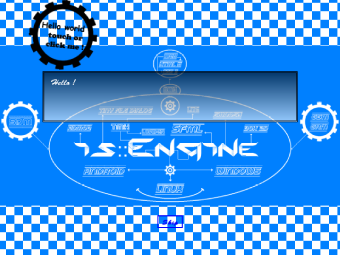

# is::Engine Web Demo
- This project allows you to launch [is::Engine Hello World](https://github.com/Is-Daouda/is-Engine) on your machine with emscripten (the project is already compiled).
- To launch the demo from your browser **[click here](https://is-daouda.github.io/)**

## Prerequisites
- Emscripen (1.39.7 +)
- Python (3.8.1 +)
- Java

## Installation
##### Windows
1. Download [Emscripten](https://github.com/emscripten-core/emsdk) and install it in **C:/emsdk**, define its path in the environment variable **Path**
2. Download [Python](https://www.python.org/downloads/release/python-381/) after installation, define its path in the environment variable **Path**
3. Download [Java](https://www.oracle.com/java/technologies/javase-jre8-downloads.html) after installation, define its path in the environment variable **Path**
4. Move the **is-Engine-Web-Demo** project to your **C:/ (C:/is-Engine-Web-Demo)**.

#### How to run it
- Execute this command :
```bash
cd c:/is-Engine-Web-Demo
emsdk activate latest
emrun --no_browser index.html
```
Note that you can also use this command which directly launches the page with your browser:
```bash
...
emrun index.html
```
But note that there can be bugs sometimes (In any case on my machine I meet some ^^).
- Visit this url **localhost:6931** (The port entered here is the one located in the terminal) in your **Web Browser**.
- If all goes well you will have a **Hello World Screen** on your **Web Browser**.



**Enjoy!**